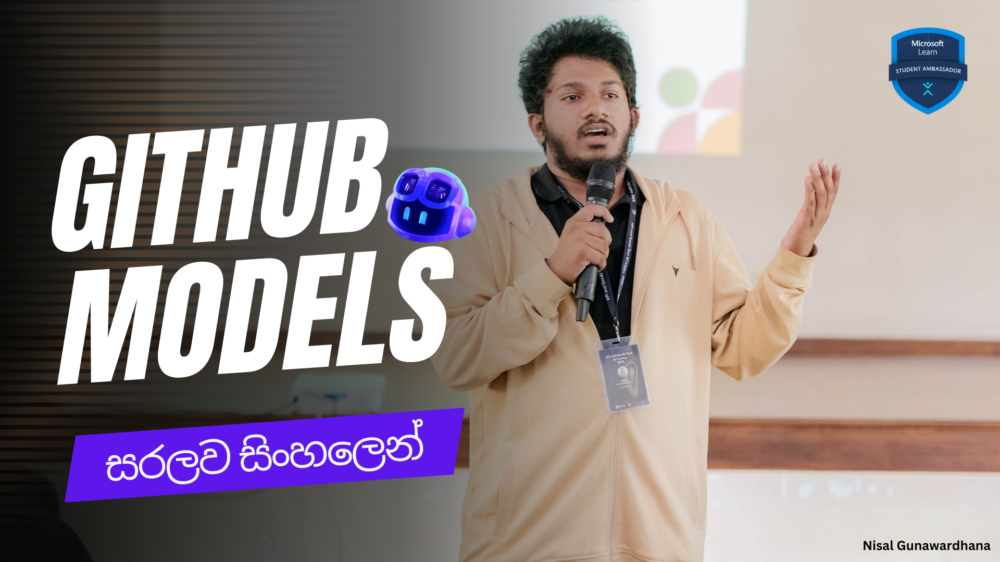

# Demo Repository for Azure OpenAI Services in GitHub Models
**by Nisal Gunawardhana**  
[](https://github.com/nisalgunawardhana)


Welcome to the **Demo Repository for Azure OpenAI Services in GitHub Models**! This repository is part of the GitHub Models session and is designed to help participants explore and understand GitHub Models. Follow the instructions below to set up and run this project.

---

## Instruction Video

[](https://youtu.be/2amZZv0-31Q)

---

---

## Related Repository

Looking for a deeper dive? Check out the [**Introduction to GitHub Models**](https://github.com/nisalgunawardhana/Introduction-to-Github-models) repository for more comprehensive resources and examples.

[](https://github.com/nisalgunawardhana/Introduction-to-Github-models)

--- 

Click the image above to watch the instruction video.

## Table of Contents
1. [Introduction](#introduction)
2. [Prerequisites](#prerequisites)
3. [Setting Up the Environment](#setting-up-the-environment)
4. [Running the Project](#running-the-project)
5. [Closing Notes](#closing-notes)

---

## Introduction

This repository serves as a hands-on demo for participants to learn how to integrate and use GitHub Models. By following the steps below, you will:
- Fork and clone the repository.
- Set up the required environment.
- Run the demo successfully.

---

## Prerequisites

Before you begin, ensure you have the following:
- **GitHub Account** to fork the repository.
- **Git** installed on your local machine.
- **Node.js** (version 14 or higher) installed.
- **NPM** (Node Package Manager) installed (comes with Node.js).
- **GitHub Personal Access Token** with appropriate permissions.

---

## Setting Up the Environment

Follow these steps to set up the environment:

1. **Fork the Repository**:
    - Navigate to the repository on GitHub.
    - Click the "Fork" button in the top-right corner to create your own copy of the repository.

2. **Clone the Forked Repository**:
    ```bash
    git clone https://github.com/Your_Username/Github-Models-Demo.git
    cd Github-Models-Demo
    ```

3. **Install Dependencies**:
    ```bash
    npm install
    ```

4. **Set Up GitHub Token**:
    - Create an `.env` file in the root directory.
    - Add the following environment variable:
      ```env
      GITHUB_TOKEN="Your-Github-Token-Here"
      ```

---

## Running the Project

1. **Start the Application**:
    ```bash
    npm start-sample
    ```

2. **Access the Application**:
    Once the application starts, you will see prompts and responses directly in the terminal.

    
---

## Customizing Messages

**You can customize the interaction by editing the messages in the following format**:

1. Open the `src/sample.js` file in the repository.
2. Modify the `messages` array to include your own context and questions. For example:
        ```javascript
        const messages = [
            { role: "developer", content: "You are a helpful assistant" },
            { role: "user", content: "<< - Your questions ->> "}
        ];
        ```
3. Save the file and restart the application:
        ```bash
        npm start
        ```

**This allows you to tailor the interaction to your specific needs**.

## Trying the Chatbot Experience

**If you want to try the chatbot experience, you can modify the `start` command in the `package.json` file as follows**:

1. Open the `package.json` file in the root directory.
2. Locate the `scripts` section and update the `start` command:
        ```json
        "start": "node ./src/chatbot.js"
        ```
3. Save the file and start the application:
        ```
        npm start
        ```

**This will run the chatbot experience instead of the default sample application**.


## Closing Notes

Once you have completed the demo:
1. Stop the application by pressing `Ctrl+C` in the terminal.
2. Clean up the repository if needed:
    ```bash
    cd ..
    rm -rf demo-repo
    ```

---

## A-Z Guideline Recap

1. Fork the repository.
2. Clone the forked repository to your local machine.
3. Install dependencies using `npm install`.
4. Add your GitHub token to the `.env` file.
5. Run the application using `npm start`.
6. Test and explore the demo.
7. Clean up after use if necessary.

Enjoy exploring GitHub Models! 🚀

## Resources

### Course: Introduction to Large Language Models
📌 **Duration**: 25 minutes  
📌 **Units**: 7  
📌 **Link**: [Learn More](https://shorturl.at/sTz0y)  

Learn the fundamentals of LLMs, their applications, and how they power AI-driven solutions. Perfect for beginners! 🚀

---

### Small & Large Language Models
📌 **Overview**: Learn the differences between small and large language models, their advantages, and when to use them in AI and machine learning workflows.  

📌 **Key Points**:  
✅ **Small LMs** – Faster, cost-effective, and ideal for precise, well-defined tasks.  
✅ **Large LMs** – Powerful, adaptable, and suited for complex, high-volume tasks.  
✅ Experiment with models on Azure Kubernetes Service (AKS) using KAITO for deployment automation.  

📌 **Read more**: [Small & Large Language Models](https://shorturl.at/FekqA)


## About the Author

This repository is maintained by **Nisal Gunawardhana**. Feel free to reach out for any questions or feedback regarding this demo.
## Connect with Me

Feel free to connect with me on [LinkedIn](https://www.linkedin.com/in/nisalgunawardhana/) for more updates and professional networking opportunities.

---

## License

This project is licensed under the **MIT License**. You are free to use, modify, and distribute this repository for educational and study purposes. See the `LICENSE` file for more details.


